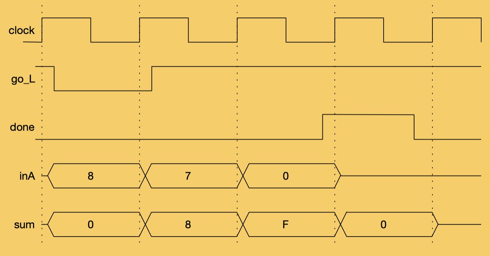

## How it works

This project is an instantiation of the Sum It Up hardware thread used as an example in Don Thomas' textbook _Logic Design and Verification Using SystemVerilog_.  I also use the thread as an example in my 18-341 course here at Carnegie Mellon University.

It is a very simple thing.  A series of 8-bit numbers are presented on the **inA** inputs on each clock edge.  If the **go_l** input is asserted, then the hardware thread will start to add each of the subsequent values (starting with the value present on the clock edge when **go_l** was asserted).  The values will be accumulated until such time as the input **inA** is equal to **8'b0**.  On that same clock edge, the **done** output will be asserted and the **sum** output will hold the 8-bit sum of all accumulated values.  Carry into higher bits is lost.

Here is a timing diagram that might clear up a few things:

## How to test

I'll work on writing some cocotb testbenches.

## External hardware

None required.
