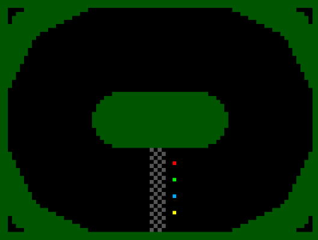
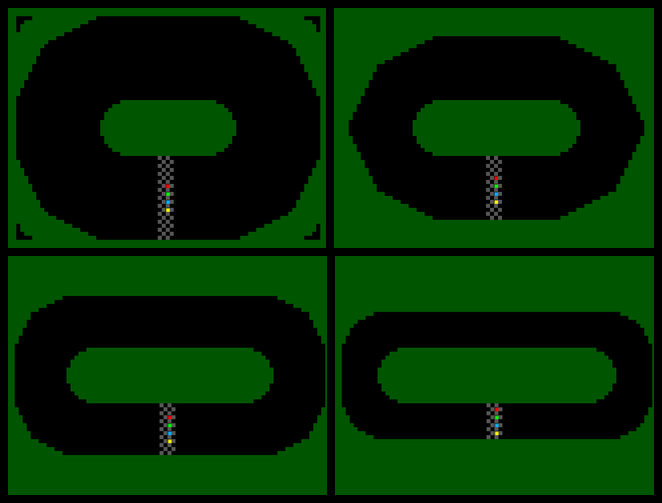

<!---
This file is used to generate the project datasheet.
-->

## How it works

A motor track racing game for up to 4 players.
Each player controls his/her bike using a single input pin:
- 0 - straight+accelerate
- 1 - turn left+brake

Bidirectional input pins select game mode:
- [1:0] - Track selection
- [3:2] - Game speed

Outpace your opponents and don't fall out of the track!

Playable online version & (upcoming) writeup: [http://devkk.net/index.php?tag=games&id=39](http://devkk.net/index.php?tag=games&id=39)
Original repository: [https://github.com/Krzysiek-K/KK-Zuzel-VGA](https://github.com/Krzysiek-K/KK-Zuzel-VGA)

### Game screenshot.

### All 4 available tracks.

The chip design features:
- 7-bit track generator CPU (with 3 custom instructions)
- Common player control block (generating 15 control signals)
- 4x player simulation block (each featuring 4 registers, 2x streaming 1-bit ALUs and a 7x7 sprite generator)
- VGA timing generator
- Top level logic (tying everything together, generating final video signal and performing collision detection)

## How to test

- Connect to VGA.
- Use Bidirectional pins [1:0] to select one of the 4 available tracks.
- Use Bidirectional pins [3:2] to select game speed.
- Use Input pin 4 to reset gameplay.
- Use Input pins [3:0] to control motobikes.

## External hardware

- VGA output PMOD
- Gameplay reset signal on Input[4] (active 1)
- 4 input signals from player controls on Input[3:0] (active 1)
- Gameplay mode switches on Bidirectional port [3:0] (active 1)
