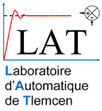

<!---

This file is used to generate your project datasheet. Please fill in the information below and delete any unused
sections.

You can also include images in this folder and reference them in the markdown. Each image must be less than
512 kb in size, and the combined size of all images must be less than 1 MB.
-->

## How it works
Display the Automation Laboratory LOGO.  

 

## How to test

Just connect to a VGA monitor. Then, to repeat the logo, use ui_in[0] for color, use ui_in[1]. 
Setting ui_in[2] to change the image displayed.

## External hardware

VGA PMOD Board
