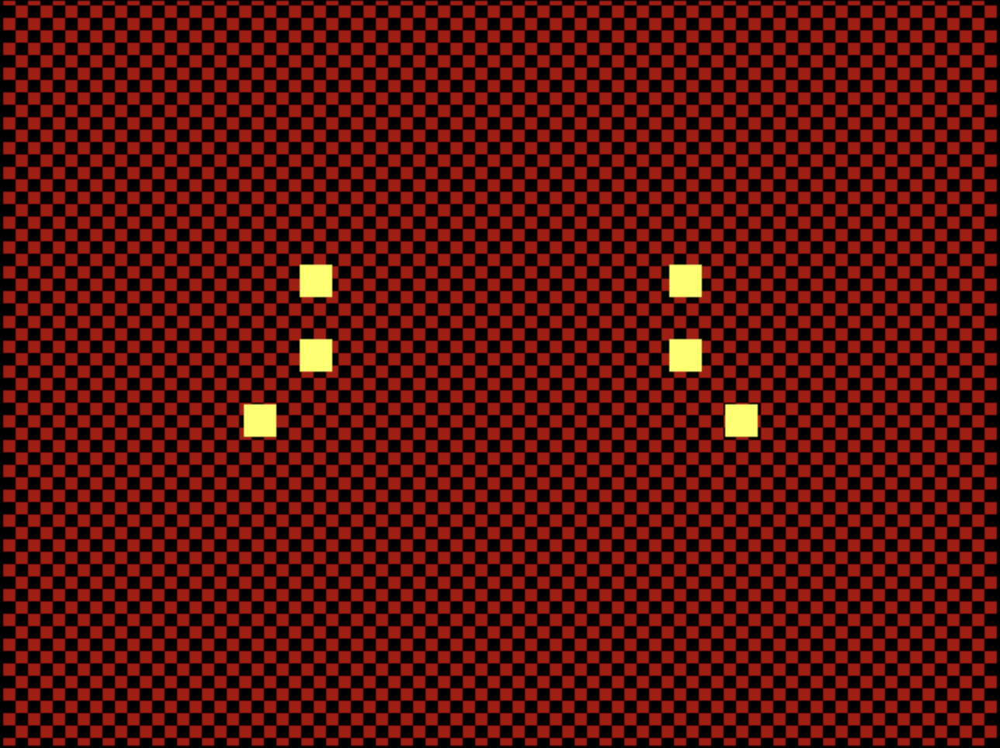
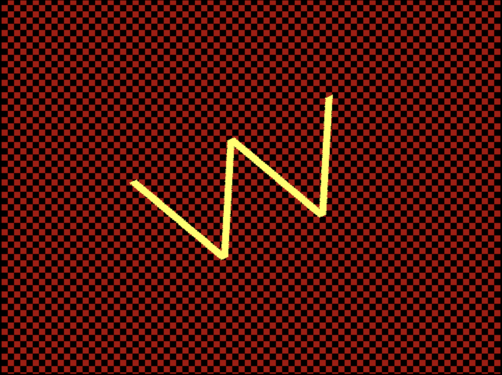

# VGA UW Demoscene

## How it works

Uses combinational logic to calculate areas that are “W-shaped” and “bullet-shaped”, causing those areas to have a different color from the checkered background. By translating/rotating these patterned areas through mathematical calculations, the chip creates the illusion of movement, in this case a U splitting down the middle and a spinning W. The chip loops from U to W and repeat. A FSM is used to switch between U-state and W-state. 

The U-state uses an array of 6 bullet areas to form the shape of a U. By modifying the values of fall_y and shift_side, the bullets are able to move left, right, and down. In order to fit both patterns on the chip, the U bullets had to be cut from 8 to 6, and their shape from circles to squares, but the spirit of U is kept. 

The W-state simulates a rotated plane by using a lookup table with sin/cos values to update the coordinates of the current pixel in the rotated plane. This makes the comparisons to detect the position of W easier as we assume the position of the W is fixed while the plane rotates

Although the initial idea was to draw out one unique pattern for each letter in “UWaterloo”, chip size and memory constraints caused us to reduce the number of letters to 2 in order to create more interesting and complex patterns.

## How to test

Upload the micropython microcontroller code to the Tiny Tapeout board’s Raspberry Pi, which sets the clk to 25mHz, and then connect the chip’s VGA output to the visual interface of choice.
