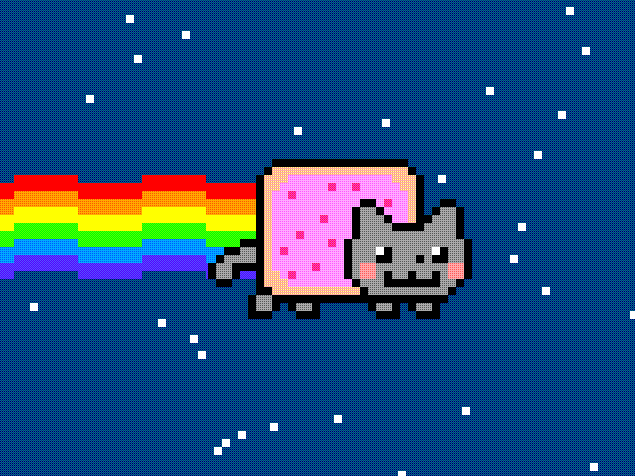

# Devil Nyan Cat VGA

## How it works

This project, developed at the **Cosmic Rays Group (UMSA)**, implements a "cursed" version of the classic Nyan Cat in hardware. It generates a 640x480 @ 60Hz VGA signal and synchronized audio.

### Visual Engine
The "Devil" effect is achieved through a real-time color transformation pipeline:
* **Green Inversion:** The green channel is bitwise inverted (`~g_src`), shifting the palette towards toxic tones.
* **Blue Suppression:** The blue channel is forced to zero (`6'b0`), resulting in an aggressive red-orange spectrum.
* **Dithering:** Uses a 2x2 Bayer matrix for better color rendition on the 2-bit per channel Pmod.

### Audio Synthesis
Sound is generated from pre-calculated note tables, split into melody and bass square waves with exponential decay envelopes, processed through a sigma-delta DAC.

## How to test

Set clock to **25.175MHz**, provide a reset pulse (`rst_n`), and observe the corrupted transmission.

## External hardware

* [TinyVGA Pmod](https://github.com/mole99/tiny-vga) for video on `uo_out[7:0]`.
* 1-bit sound on `uio_out[7]`, compatible with [Tiny Tapeout Audio Pmod](https://github.com/MichaelBell/tt-audio-pmod) or a simple RC filter.

**Author:** Daniel Roberto Garcia Miranda (Dani3184)