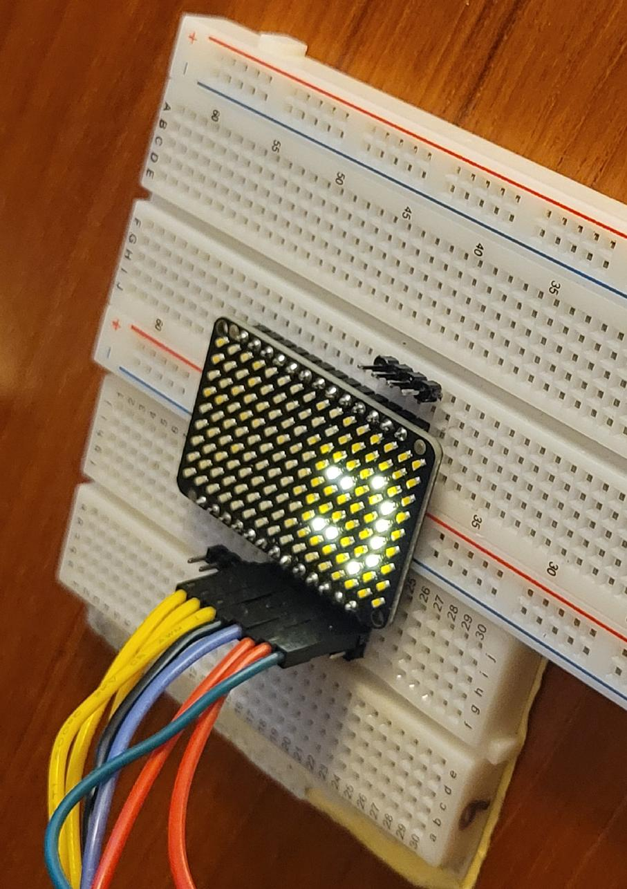

<!---

This file is used to generate your project datasheet. Please fill in the information below and delete any unused
sections.

You can also include images in this folder and reference them in the markdown. Each image must be less than
512 kb in size, and the combined size of all images must be less than 1 MB.
-->

## How it works

This is a controller for an Adafruit Charlieplex LED array.  The Adafruit arrays are
larger than can be controlled with 8 bidirectional bits, so the maximum size of LED
that is controllable with a Tiny Tapeout project is 8x7, or 56 LEDs.  When enabled
and connected to the first 8 pins on one side of the Charlieplex array, the default
display is a brightness gradient from one side to the other.  The UART interface can
be used to input a different display.

Because LEDs in the Charlieplex array can only be addressed one at a time, the
brightness is maximized in this implementation by turning each LED on for a
duration proportional to the brightness.  That makes the brightness value relative
to the number of LEDs that are on.

## How to test

Connect the 8 signal pins of the bidirectional I/O PMOD to the first 8 pins on one
side of the Charlieplex array.  On reset, the display will turn on all LEDs with
a brightness gradient from one side to the other.

The LED display can be customized by an input of data through UART.  The project has
a 1-pin UART interface (receive only), with Rx on ui_in[0].  The baud rate is set
to 9600 for the default 50MHz clock.  Inputs are ASCII characters.  Values '0' to '9'
and 'A' to 'F' set the LED brightness (0 to 15), and values 'G' and higher set the
pixel address to modify.  Every value auto-increments the pixel address by 1, so
the display can be cleared by sending character 'G' followed by fifty-six characters
'0'.  The UART format is 8 bits data with 1 start and 1 stop bit.

## External hardware

Adafruit Charlieplex array (plain, without a controller):
https://www.adafruit.com/product/3162 or equivalent
(comes in a number of colors, some of which may not be in stock).
