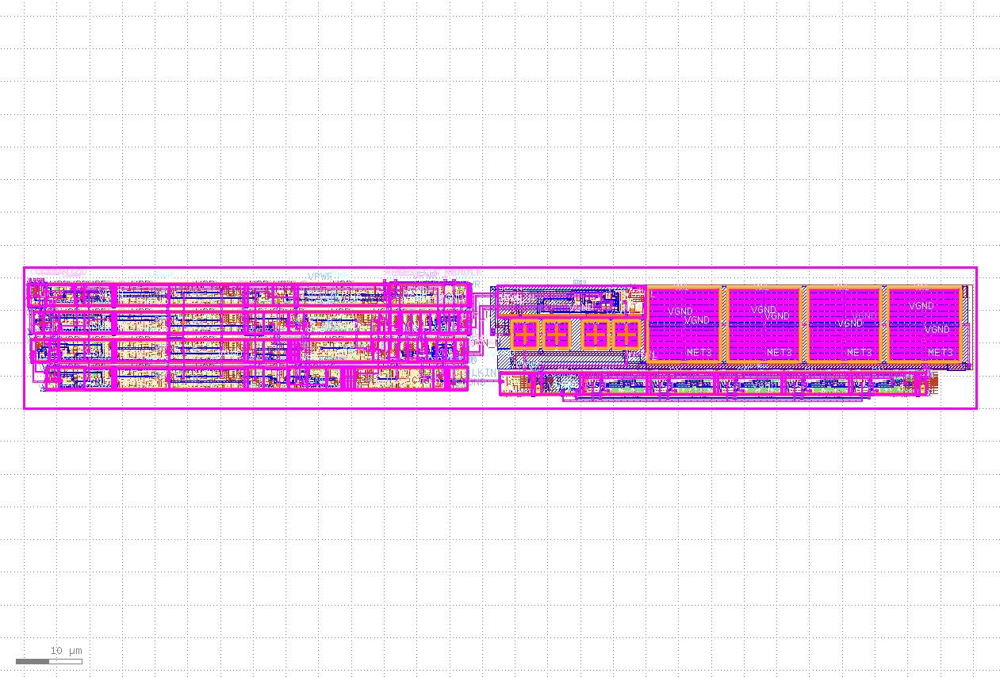

## How it works

The PLL looks like this

On the left hand side are Sky HS logic blocks, they include a programmable clock scaler (a 4 bit down counter set
by the COUNT\_* pins), a reset logic that looks for clock stability and after detecting 16 good clocks asserts RESET\_OUT\_N, and a phase detector that compares the output of the clock scaler with a reference clock and drives the charge pump.

On the right are the analog blocks. Along the bottom is a variable frequency oscillator (VCO),
5 stages, Top left is the charge pump that drives the VCTRL output voltage into the oscillator. The 4 large square boxes to the right are capacitors charged from VCTRL through a long poly resistor that snakes the width of the block. The 2 small square boxes to the right are a smaller capacitor also on VCTRL.. The other 2 caps are decoupling caps for the charge pump.

## Interface

The resulting block is intended to be a drop in to Sky TT projects, Its interface is very simple, inputs are:

* COUNT\_3-COUNT\_0 - these scale the reference clock by N-1 (so a value of 1 means 2 times, a value of 7 means 8 times) for example with a value of 7 and a 25MHz reference clock the PLL should generate 200MHz
* REFCLK - this is the input reference clock, this is intended to be connected to the Tiny Tapeout tile clock
input. If you want more flexibility in generated frequencies you can divide down to a lower frequency, the phase detector only looks at the rising edge of the reference clock so it doesn't need to be a square wave (jitter added to the reference clock is reflected in jitter in the output clock).
* RESET\_N - this an async reset, it can (should) be applied before the PLL starts. The PLL starts when RESET\_N is released. It is intended to be connected directly to the Tiny Tapeout rst\_n pin.

Outputs are:
* CLK - the resulting clock - at reset this in undefined, some time after RESET\_N is removed it will be active
at the desired frequency (COUNT\+1)\*f(REFCLK) (it's your responsibility to choose frequencies that the PLL can
actually generate - roughly 50-300MHz, outside that range the results are undefined)
* RESET\_OUT\_N - this is a synchronous signal (wrt CLK) that is asserted by RESET\_N until the clock is fairly stable - it's intended use is to hold a design in reset until the clock is stable, through the period when it might be thrashing around as the VCO starts up - your design should ignore the Tiny Tapeout rst\_n and use this signal - note this signal is generated internally, your design might have a deep clock tree, it may be useful to run this through a flop before you use it to meet setup/hold. This signal is asserted by RESET\_N and cleared when the clock becomes stable enough to use, it is not asserted again until RESET\_N is asserted. This signal is cleared BEFORE the clock is completely stable (we'll characterize this with spice later), clock freq may go slightly higher that desired (a few percent) as it settles.

# This project

This is a 1x1 TT tile with the PLL laid along the bottom, the tile connects RESET\_N to the TT rst\_n and COUNT to ui\_in\[3:0\]. ui\_in\[7:4\] are connected to a down counter from the TT clk, the output is used to drive REFCLK (unless ui\_in\[7:4\]==0 in which case REFCLK is driven directly from the TT clk.

The output CLK is connected to uo\_out\[0\] a 4 bit counter driven from CLK is connected to uo\_out\[5:2\] finally RESET\_OUT\_N is connected to uo\_out\[1\]. It is expected that at many frequencies the upper bits of the counter and the output clock wont make it to the TT pins.

## How to test

Drive ui\_in with 8'n0000\_0001 (2 times freq), Set the TT clock to 25MHz. Assert reset, uo\_out\[1\] should go low, clear reset, uo\_out\[1\] should high. If we get this far the PLL is making a good clock. You can now look at the uo\_out pins on a scope to check the freq.

## External hardware

a scope to look at the output signals
