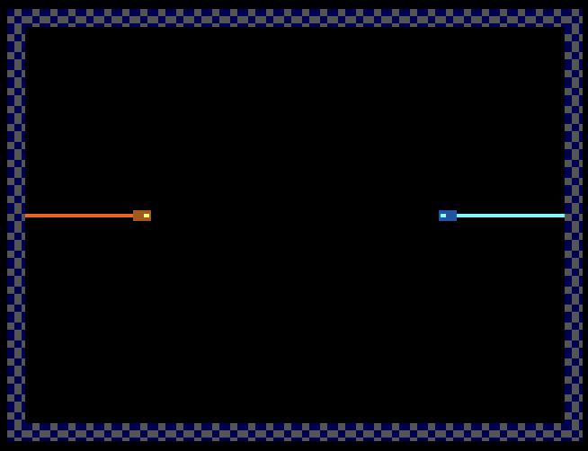

<!---

This file is used to generate your project datasheet. Please fill in the information below and delete any unused
sections.

You can also include images in this folder and reference them in the markdown. Each image must be less than
512 kb in size, and the combined size of all images must be less than 1 MB.
-->

## How it works

The design implements a two-player Tron light-cycle game rendered over VGA (640×480 @ 60 Hz). The native VGA coordinates are halved to produce a virtual resolution of 320×240, which is then divided into a 32-column by 24-row grid of 10×10 pixel cells. The outer ring of cells forms the wall boundary, leaving a 30×22 playable arena.

Each player's light trail is stored as a circular buffer of up to 16 segments, where each segment holds a 5-bit column and a 5-bit row coordinate. A head pointer indexes the most recent position. On every game tick (once every 8 frames, roughly 7.5 moves per second), each player's head advances one cell in its current direction, and the oldest segment in the ring buffer is implicitly overwritten, keeping the visible trail length fixed.

Collision detection uses parallel combinational comparators across all buffer slots. Wall collisions check whether each player's next head position falls on a border cell (column 0, column 31, row 0, or row 23). Self-collisions and cross-collisions compare the next head position against all 16 slots of both trail buffers. A head-to-head collision is also detected when both players attempt to move into the same cell. Any collision triggers the game-over state.

The pixel-to-grid mapping uses a multiply-by-reciprocal technique (×205 >> 11) to divide by 10 without a hardware divider, producing the cell column and row for each pixel. Intra-cell coordinates are derived by subtracting the reconstructed cell origin. The drawing engine uses a parallel generate block to test every pixel against all trail segments at pixel rate. Each player's head cell contains a procedural directional sprite with a body region and an engine glow that rotates to face the current direction of travel. Trail segments behind the head are drawn as a narrow 2-pixel-wide light wall centered in the cell, oriented along the player's axis of movement.

Player 1 is rendered in orange/amber tones. Player 2 is rendered in cyan tones. The border uses a blue checkerboard pattern. On game over, both trails turn red until any button is pressed to restart. Direction input is latched on every clock edge with 180-degree reversal prevention (a player moving right cannot immediately switch to left, and so on). The latched direction is committed to the active direction register on each game tick.

## How to test

Connect a TinyVGA to the output pins and eight active-high pushbuttons to the input pins. After reset, Player 1's light cycle starts on the left side of the arena moving right, and Player 2 starts on the right side moving left. Each player steers with four directional buttons. The trails extend behind each cycle as it moves. Crashing into any wall, either player's trail, or head-on into the other cycle triggers game over (both trails turn red). Press any button to restart.

## External hardware

- TinyVGA (active on output port for 640×480 VGA)
- Eight momentary pushbuttons connected as follows:
  - ui_in[0]: Player 1 Up
  - ui_in[1]: Player 1 Down
  - ui_in[2]: Player 1 Left
  - ui_in[3]: Player 1 Right
  - ui_in[4]: Player 2 Up
  - ui_in[5]: Player 2 Down
  - ui_in[6]: Player 2 Left
  - ui_in[7]: Player 2 Right
- VGA-compatible monitor or display
